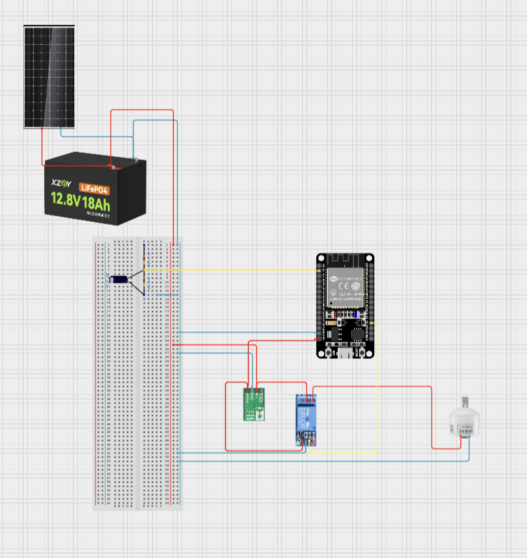

# How to Add Images to Documentation

## Method 1: Local Image File (Recommended)

### Step 1: Save Your Image

Save your circuit diagram or photo in the same folder as your documentation:

```
/voltage_meter/
├── CIRCUIT_DOCUMENTATION.md
├── circuit_diagram.png         ← Your image here
├── voltage_meter.ino
└── README.md
```

### Step 2: Reference in Markdown

```markdown

```

**With caption:**
```markdown

*Figure 1: Complete circuit schematic showing all connections*
```

---

## Method 2: Using URL (Online Image)

### If Your Image is Online

```markdown

```

**Example with GitHub:**
```markdown

```

---

## Method 3: Multiple Images

### Add Several Images

```markdown
## Circuit Photos

### Top View


### Wiring Detail


### Completed Assembly

```

---

## Supported Image Formats

✅ **PNG** - Best for diagrams, schematics (circuit_diagram.png)  
✅ **JPG/JPEG** - Best for photos (circuit_photo.jpg)  
✅ **GIF** - Supports animation (relay_animation.gif)  
✅ **SVG** - Vector graphics (schematic.svg)

---

## Image Size Recommendations

| Type | Recommended Size | Max File Size |
|------|-----------------|---------------|
| **Circuit Diagram** | 1200x800px | < 500KB |
| **Photos** | 1920x1080px | < 2MB |
| **Icons** | 256x256px | < 100KB |

---

## Tips for Good Circuit Diagrams

1. **Use high contrast** - Black lines on white background
2. **Label components** - R1, R2, U1, etc.
3. **Show pin numbers** - GPIO36, GPIO27, etc.
4. **Include power rails** - Mark +12V, +5V, GND clearly
5. **Add color coding** - Red for positive, black for ground
6. **Export as PNG** - Better than JPG for schematics

---

## Where to Create Circuit Diagrams

### Free Tools:

**Fritzing** (Most Popular)
- Download: [fritzing.org](https://fritzing.org/)
- Great for breadboard and PCB layouts
- Export as PNG

**EasyEDA** (Online)
- URL: [easyeda.com](https://easyeda.com/)
- Professional schematic editor
- Free and browser-based

**Circuit Diagram** (Simple)
- URL: [circuit-diagram.org](https://circuit-diagram.org/)
- Very simple, drag-and-drop
- Good for basic schematics

**TinkerCAD Circuits** (Simulation)
- URL: [tinkercad.com](https://www.tinkercad.com/circuits)
- Visual circuit builder
- Can simulate ESP32 projects

---

## Example: Adding to Your Documentation

### In CIRCUIT_DOCUMENTATION.md

Find this section:
```markdown
## Circuit Diagram

### Add Your Circuit Image Here:


```

Replace with:
```markdown
## Circuit Diagram

### Complete System Schematic


*Figure 1: Full system showing battery, solar, ESP32, and relay connections*

### Voltage Divider Detail


*Figure 2: 100kΩ/10kΩ voltage divider connected to ESP32 VP pin*

### Physical Assembly


*Figure 3: Completed circuit with all components mounted*
```

---

## Quick Markdown Image Syntax

```markdown
Basic:


With Title (tooltip):


With Link:
[](https://link-when-clicked.com)

Centered (HTML in Markdown):
<p align="center">
  
</p>

Resized:

```

---

## Checklist Before Adding Images

- [ ] Image is clear and readable
- [ ] File size is reasonable (< 2MB)
- [ ] Filename has no spaces (use underscores: `circuit_diagram.png`)
- [ ] Image is in same folder as markdown file
- [ ] Alt text describes the image
- [ ] Caption explains what the image shows

---

## Example Files Structure

```
voltage_meter/
│
├── CIRCUIT_DOCUMENTATION.md
├── README.md
├── voltage_meter.ino
│
├── images/                          ← Create this folder
│   ├── circuit_diagram.png          ← Schematic
│   ├── voltage_divider_detail.png   ← Close-up
│   ├── assembly_photo.jpg           ← Photo
│   └── relay_wiring.png             ← Detail
│
└── HOW_TO_ADD_IMAGES.md (this file)
```

### Then reference them:

```markdown


```

---

## GitHub/Git Notes

### Adding Images to Git

```bash
# Add image files
git add images/*.png
git add circuit_diagram.png

# Commit
git commit -m "Add circuit diagrams and photos"

# Push to GitHub
git push origin main
```

### View on GitHub

GitHub automatically displays images in markdown files!

---

## Need Help?

1. Take a photo of your circuit
2. Save as `circuit_photo.jpg`
3. Put in same folder as `CIRCUIT_DOCUMENTATION.md`
4. Add this line where you want it:
   ```markdown
   
   ```
5. Done! ✅

---

**Pro Tip:** Start with a simple photo of your working circuit. You can always add professional diagrams later!
